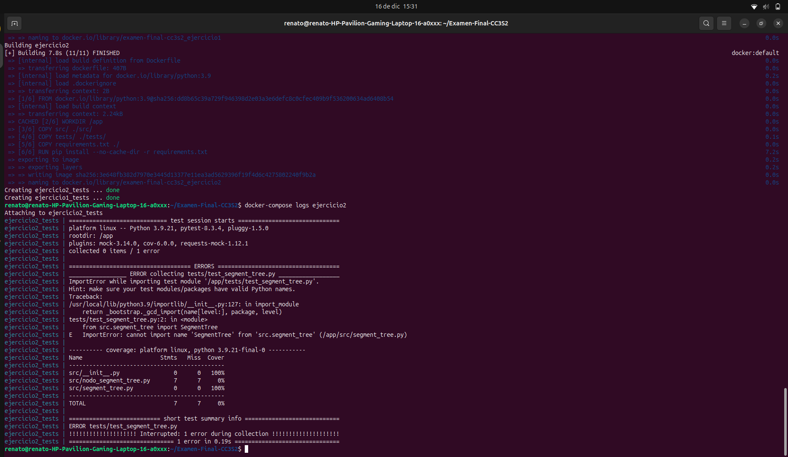
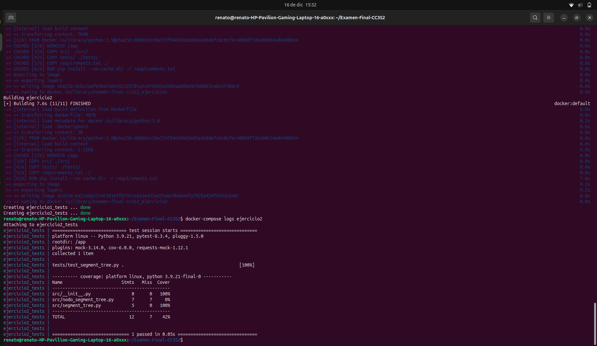
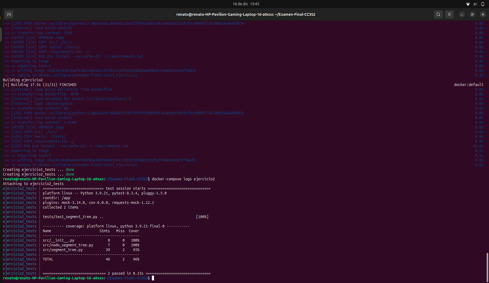

# **Examen Final - CC3S2**

## **Ejercicio 1: Algoritmo de búsqueda de rutas óptimas con BFS invertido y heurística de conexión**

### **Descripción del Ejercicio**
El objetivo de este ejercicio es implementar un **algoritmo de búsqueda de rutas óptimas** en un grafo dirigido. A diferencia del BFS clásico, este algoritmo:
1. **Invierte la lógica**: Parte desde el nodo **destino** y se expande "hacia atrás" para encontrar las rutas más eficientes hacia los posibles nodos de origen.
2. **Incluye una heurística** de **"conexión tardía"**: La heurística limita la conexión entre nodos a partir de ciertos criterios (p. ej., si el costo acumulado en una ruta supera un umbral, esa ruta es descartada).

Se requiere además:
- Implementar pruebas unitarias utilizando **pytest**.
- Aplicar **TDD (Red-Green-Refactor)**.
- Contenedores Docker para ejecutar las pruebas de manera aislada.

---

### **Estructura del Proyecto**

```
Examen-Final-CC3S2/
├── docker-compose.yml          # Orquestador principal para levantar el contenedor
├── Ejercicio1/                 # Directorio del ejercicio 1
│   ├── Dockerfile              # Dockerfile específico para el ejercicio 1
│   ├── requirements.txt        # Dependencias del proyecto
│   ├── src/                    # Código fuente del algoritmo
│   │   ├── algoritmo_bfs_invertido.py
│   │   ├── heuristica_conexion.py
│   │   └── __init__.py         # Archivo necesario para el módulo src
│   ├── tests/                  # Directorio con pruebas unitarias
│   │   ├── test_algoritmo.py
│   │   └── __init__.py
```

---

### **Requisitos Previos**
- Tener instalado **Docker** y **docker-compose**.
- Asegurarse de que el puerto adecuado esté libre para ejecutar el contenedor.

---

### **Comandos para Ejecutar el Proyecto**

1. **Construir y levantar el contenedor**:
   Desde la raíz del proyecto, ejecuta el siguiente comando:

   ```bash
   docker-compose up --build -d
   ```

   - `--build`: Fuerza la reconstrucción de la imagen.
   - `-d`: Ejecuta los contenedores en segundo plano.
   - Este comando levantará el servicio definido en el archivo `docker-compose.yml`.

* ***Resultado***


2. **Ver los logs del contenedor**:
   Para verificar el resultado de las pruebas, usamos:

   ```bash
   docker-compose logs ejercicio1
   ```

3. **Apagar el contenedor**:
   Una vez finalizado, detenemos los contenedores con:

   ```bash
   docker-compose down
   ```

---

### **Comportamiento Esperado**

1. Al ejecutar `docker-compose up`, el contenedor realizará lo siguiente:
   - Instalará las dependencias necesarias desde `requirements.txt`.
   - Ejecutará **pytest** con cobertura de código utilizando el comando:
     ```bash
     pytest --cov=src --cov-report=term
     ```
2. Si todo está correcto, se mostrará un mensaje indicando que **las pruebas han pasado**.
3. Si existe un fallo en el código o en los tests, se detallará el **error** en los logs.

---

### **Uso de RGR**
1. **RED**
Primero se tuvo que escribir los tests, y al ver los resultados de las pruebas, vemos que falló:


2. **GREEN**
Tuvimos que implementar la mínima lógica para que pasen los tests, haciendo los cambios respectivos en `algoritmo_bfs_invertido.py`. Luego ejecutamos el siguiente comando: `docker-compose up --build -d`.

Luego revisamos los resultados de las pruebas: `docker-compose logs ejercicio1`.


* Vemos que han pasado.

3. **REFACTOR**

Aquí tienes una sección **actualizada y breve** sobre la **refactorización** del código para incluir en el README:

---

### **3. Refactorización del Código**

Durante la implementación del algoritmo **BFS invertido**, se realizaron las siguientes mejoras clave:

- **Uso de una cola de prioridad**: Se implementó **`heapq`** (min-heap) para garantizar que los nodos se expandan en orden de menor costo acumulado, mejorando la eficiencia del algoritmo.
- **Control de nodos visitados**: Se utilizó un **diccionario `visitados`** para registrar el menor costo acumulado a cada nodo y evitar procesar rutas subóptimas.
- **Aplicación de la heurística**: La heurística `verificar_carga` se evalúa antes de agregar nodos a la lista de resultados, asegurando que solo se consideren rutas válidas según el criterio de costo.
- **Exclusión del nodo destino**: Se evitó incluir el nodo de inicio (`destino`) en la lista final de rutas.

La refactorización garantiza que el algoritmo sea:
- **Más eficiente**: Procesa los nodos de manera prioritaria.
- **Más limpio**: Se eliminan redundancias y se organiza mejor la lógica.
- **Correcto**: Cumple estrictamente con las restricciones impuestas por la heurística.

**Código Final Refactorizado**:
```python
import heapq
from src.heuristica_conexion import HeuristicaConexion

class BFSInvertido:
    def __init__(self, grafo, heuristica: HeuristicaConexion):
        self.grafo = grafo
        self.heuristica = heuristica

    def buscar_ruta_optima(self, destino):
        visitados = {}  # Menor costo acumulado a cada nodo
        cola = []
        heapq.heappush(cola, (0, destino))  # (costo acumulado, nodo)
        rutas = []

        while cola:
            costo, nodo_actual = heapq.heappop(cola)

            if nodo_actual in visitados and visitados[nodo_actual] <= costo:
                continue

            visitados[nodo_actual] = costo

            if nodo_actual != destino and self.heuristica.verificar_carga(nodo_actual, costo):
                rutas.append((nodo_actual, costo))

            for vecino, peso in self.grafo.get(nodo_actual, []):
                heapq.heappush(cola, (costo + peso, vecino))

        return sorted(rutas, key=lambda x: x[1])  # Ordena por costo acumulado
```
* **Se adjunta el resultado**
Una vez realizados los cambios en `algoritmo_bfs_invertido.py` se vuelve a ejecutar de nuevo el comando: `docker-compose up --build -d`.

Luego revisamos los resultados de las pruebas: `docker-compose logs ejercicio1`


---

### **Conclusión**
Este ejercicio implementa de manera eficiente un **BFS invertido** con heurística utilizando:
- **Python** y un enfoque de **TDD**.
- **pytest** para pruebas unitarias con métricas de cobertura.
- **Docker** y **docker-compose** para ejecutar el proyecto en un entorno aislado.
---

## **Ejercicio 2: Estructura de datos persistente con árbol binario de segmentos "multi-versión"**

### **Descripción del Ejercicio**

El objetivo del ejercicio es implementar un **árbol de segmentos persistente (multi-versión)** que permita:
1. **Versionado histórico**: Guardar múltiples versiones del árbol sin modificar versiones anteriores.
2. **Consultas de rango**: Obtener valores agregados (como suma) sobre un subintervalo del arreglo en cualquier versión específica del árbol.
3. **Actualización eficiente**: Insertar o actualizar un valor en el árbol generando una **nueva versión** (O(log n)).

La estructura del árbol está basada en un **segment tree** clásico que divide el arreglo en segmentos y almacena información en cada nodo. Al actualizar un nodo, solo los nodos afectados se clonan, mientras que el resto del árbol comparte los nodos existentes.

---

### **Estructura del Proyecto**

La estructura del proyecto sigue la organización modular y separada:

```
Examen-Final-CC3S2/
├── docker-compose.yml          # Orquestador para levantar el contenedor
├── Ejercicio2/
│   ├── Dockerfile              # Dockerfile para el ejercicio 2
│   ├── requirements.txt        # Dependencias del proyecto
│   ├── src/                    # Código fuente
│   │   ├── nodo_segment_tree.py
│   │   ├── segment_tree.py
│   │   └── __init__.py
│   ├── tests/                  # Pruebas unitarias
│   │   ├── test_segment_tree.py
│   │   └── __init__.py
```

---

## **RED-GREEN-REFACTOR (Proceso de TDD)**

### **1. RED: Escribir una Prueba que Falla**

Primero escribimos un test para validar la creación del árbol base.

**Archivo `test_segment_tree.py`:**
```python
import pytest
from src.segment_tree import SegmentTree

@pytest.fixture
def arreglo_inicial():
    return [1, 2, 3, 4, 5]

def test_creacion_arbol(arreglo_inicial):
    st = SegmentTree(arreglo_inicial)
    assert st.consultar_rango(0, 5, 0) == 15  # La suma total debe ser 15
```

- **Ejecutar la prueba**:
   ```bash
   docker-compose up --build -d
   ```

- **Resultado esperado**:  
   La prueba **fallará** porque la clase `SegmentTree` aún no tiene la lógica implementada.

- **Se adjunta la captura de pantalla**


---

### **2. GREEN: Implementar la Funcionalidad Básica**

Implementamos la clase `SegmentTree` con el código mínimo necesario para que la prueba pase.

**Archivo `segment_tree.py`:**
```python
from src.nodo_segment_tree import NodoSegmentTree

class SegmentTree:
    def __init__(self, arr):
        self.versiones = []  # Lista de versiones
        self.versiones.append(self._construir_arbol(arr, 0, len(arr)))

    def _construir_arbol(self, arr, start, end):
        if start == end - 1:  # Nodo hoja
            return NodoSegmentTree(start, end, arr[start])
        
        mid = (start + end) // 2
        nodo = NodoSegmentTree(start, end)
        nodo.left = self._construir_arbol(arr, start, mid)
        nodo.right = self._construir_arbol(arr, mid, end)
        nodo.value = nodo.left.value + nodo.right.value
        return nodo

    def consultar_rango(self, start, end, version):
        raiz = self.versiones[version]
        return self._consultar_rango(raiz, start, end)

    def _consultar_rango(self, nodo, start, end):
        if nodo.start >= end or nodo.end <= start:
            return 0
        if nodo.start >= start and nodo.end <= end:
            return nodo.value
        return self._consultar_rango(nodo.left, start, end) + \
               self._consultar_rango(nodo.right, start, end)
```

- **Ejecutar la prueba nuevamente**:
   ```bash
   docker-compose up --build -d
   ```

- **Resultado esperado**:  
   La prueba **pasará** porque ahora la funcionalidad básica está implementada.

- **Se adjunta la captura de pantalla**



---

### **3. REFACTOR: Mejorar y Optimizar el Código**

Refactorizamos el código para soportar:
- **Actualización de valores** generando nuevas versiones.
- **Consultas eficientes** en cualquier versión.

**Archivo `segment_tree.py` Refactorizado**:
```python
def actualizar(self, index, valor, version):
    raiz_anterior = self.versiones[version]
    nueva_raiz = self._actualizar(raiz_anterior, index, valor)
    self.versiones.append(nueva_raiz)

def _actualizar(self, nodo, index, valor):
    if nodo.start == nodo.end - 1:
        return NodoSegmentTree(nodo.start, nodo.end, valor)

    mid = (nodo.start + nodo.end) // 2
    nuevo_nodo = NodoSegmentTree(nodo.start, nodo.end)

    if index < mid:
        nuevo_nodo.left = self._actualizar(nodo.left, index, valor)
        nuevo_nodo.right = nodo.right
    else:
        nuevo_nodo.right = self._actualizar(nodo.right, index, valor)
        nuevo_nodo.left = nodo.left

    nuevo_nodo.value = nuevo_nodo.left.value + nuevo_nodo.right.value
    return nuevo_nodo
```

- **Agregar pruebas adicionales**:
```python
def test_actualizacion_versiones(arreglo_inicial):
    st = SegmentTree(arreglo_inicial)
    st.actualizar(2, 10, 0)  # Actualiza índice 2 a 10
    assert st.consultar_rango(0, 5, 1) == 22  # Nueva suma
    assert st.consultar_rango(0, 5, 0) == 15  # Versión original sin cambios
```
- **Resultados esperados**
- **Se adjunta la captura de pantalla**


---

## **Comandos para Ejecutar el Proyecto**

### **1. Levantar el Contenedor**
```bash
docker-compose up --build -d
```

### **2. Ver los Resultados**
Para ver los logs y el reporte de cobertura:
```bash
docker-compose logs ejercicio2
```

### **3. Apagar el Contenedor**
```bash
docker-compose down
```

---


## **Conclusión**

Este ejercicio demuestra el uso del **segment tree** para estructuras persistentes, aplicando un enfoque **TDD** con el ciclo **Red-Green-Refactor**:
1. **Red**: Escribir pruebas que fallan.
2. **Green**: Implementar funcionalidad mínima para pasar las pruebas.
3. **Refactor**: Optimizar el código sin cambiar el comportamiento.


