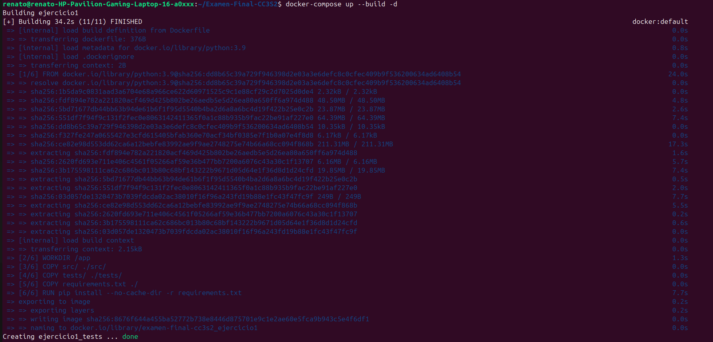
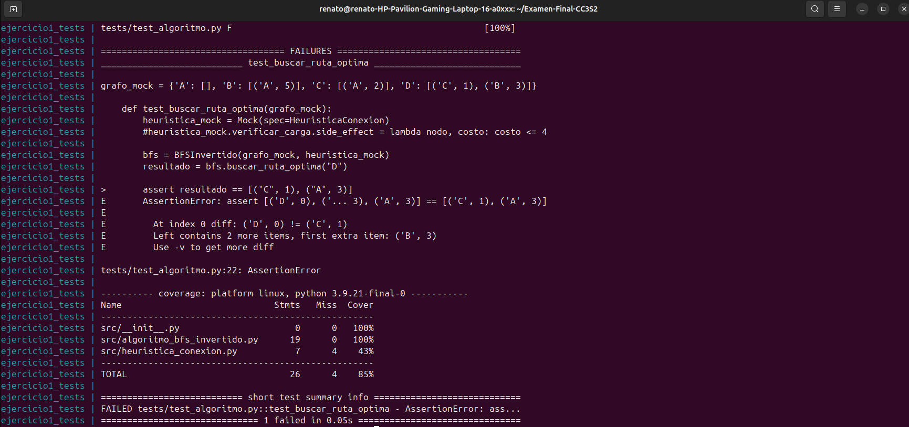
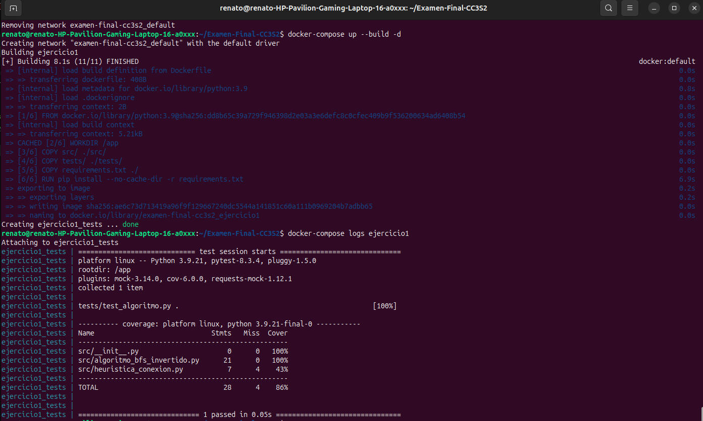
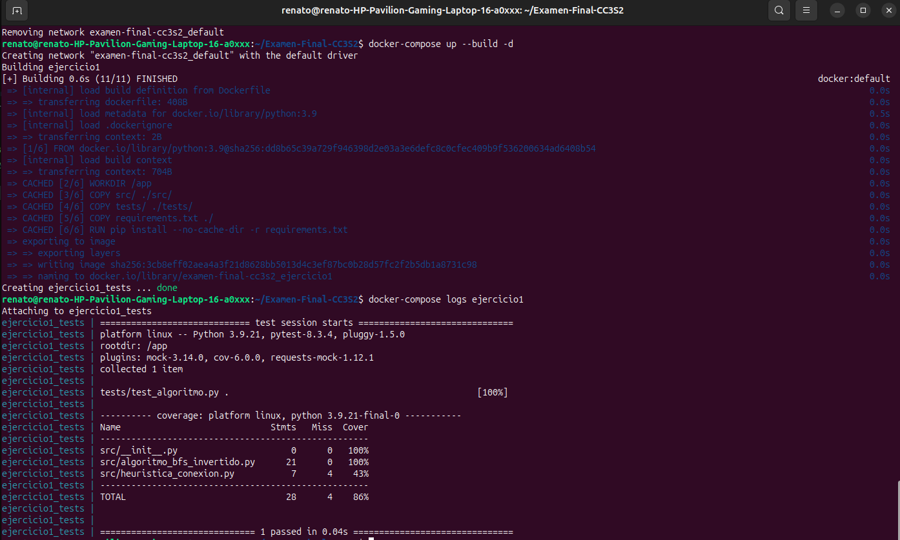

# **Examen Final - CC3S2**

## **Ejercicio 1: Algoritmo de búsqueda de rutas óptimas con BFS invertido y heurística de conexión**

### **Descripción del Ejercicio**
El objetivo de este ejercicio es implementar un **algoritmo de búsqueda de rutas óptimas** en un grafo dirigido. A diferencia del BFS clásico, este algoritmo:
1. **Invierte la lógica**: Parte desde el nodo **destino** y se expande "hacia atrás" para encontrar las rutas más eficientes hacia los posibles nodos de origen.
2. **Incluye una heurística** de **"conexión tardía"**: La heurística limita la conexión entre nodos a partir de ciertos criterios (p. ej., si el costo acumulado en una ruta supera un umbral, esa ruta es descartada).

Se requiere además:
- Implementar pruebas unitarias utilizando **pytest**.
- Aplicar **TDD (Red-Green-Refactor)**.
- Contenedores Docker para ejecutar las pruebas de manera aislada.

---

### **Estructura del Proyecto**

```
Examen-Final-CC3S2/
├── docker-compose.yml          # Orquestador principal para levantar el contenedor
├── Ejercicio1/                 # Directorio del ejercicio 1
│   ├── Dockerfile              # Dockerfile específico para el ejercicio 1
│   ├── requirements.txt        # Dependencias del proyecto
│   ├── src/                    # Código fuente del algoritmo
│   │   ├── algoritmo_bfs_invertido.py
│   │   ├── heuristica_conexion.py
│   │   └── __init__.py         # Archivo necesario para el módulo src
│   ├── tests/                  # Directorio con pruebas unitarias
│   │   ├── test_algoritmo.py
│   │   └── __init__.py
```

---

### **Requisitos Previos**
- Tener instalado **Docker** y **docker-compose**.
- Asegurarse de que el puerto adecuado esté libre para ejecutar el contenedor.

---

### **Comandos para Ejecutar el Proyecto**

1. **Construir y levantar el contenedor**:
   Desde la raíz del proyecto, ejecuta el siguiente comando:

   ```bash
   docker-compose up --build -d
   ```

   - `--build`: Fuerza la reconstrucción de la imagen.
   - `-d`: Ejecuta los contenedores en segundo plano.
   - Este comando levantará el servicio definido en el archivo `docker-compose.yml`.

* ***Resultado***


2. **Ver los logs del contenedor**:
   Para verificar el resultado de las pruebas, usamos:

   ```bash
   docker-compose logs ejercicio1
   ```

3. **Apagar el contenedor**:
   Una vez finalizado, detenemos los contenedores con:

   ```bash
   docker-compose down
   ```

---

### **Comportamiento Esperado**

1. Al ejecutar `docker-compose up`, el contenedor realizará lo siguiente:
   - Instalará las dependencias necesarias desde `requirements.txt`.
   - Ejecutará **pytest** con cobertura de código utilizando el comando:
     ```bash
     pytest --cov=src --cov-report=term
     ```
2. Si todo está correcto, se mostrará un mensaje indicando que **las pruebas han pasado**.
3. Si existe un fallo en el código o en los tests, se detallará el **error** en los logs.

---

### **Uso de RGR**
1. **RED**
Primero se tuvo que escribir los tests, y al ver los resultados de las pruebas, vemos que falló:



2. **GREEN**
Tuvimos que implementar la mínima lógica para que pasen los tests, haciendo los cambios respectivos en `algoritmo_bfs_invertido.py`. Luego ejecutamos el siguiente comando: `docker-compose up --build -d`.

Luego revisamos los resultados de las pruebas: `docker-compose logs ejercicio1`.




* Vemos que han pasado.

3. **REFACTOR**

Aquí tienes una sección **actualizada y breve** sobre la **refactorización** del código para incluir en el README:

---

### **3. Refactorización del Código**

Durante la implementación del algoritmo **BFS invertido**, se realizaron las siguientes mejoras clave:

- **Uso de una cola de prioridad**: Se implementó **`heapq`** (min-heap) para garantizar que los nodos se expandan en orden de menor costo acumulado, mejorando la eficiencia del algoritmo.
- **Control de nodos visitados**: Se utilizó un **diccionario `visitados`** para registrar el menor costo acumulado a cada nodo y evitar procesar rutas subóptimas.
- **Aplicación de la heurística**: La heurística `verificar_carga` se evalúa antes de agregar nodos a la lista de resultados, asegurando que solo se consideren rutas válidas según el criterio de costo.
- **Exclusión del nodo destino**: Se evitó incluir el nodo de inicio (`destino`) en la lista final de rutas.

La refactorización garantiza que el algoritmo sea:
- **Más eficiente**: Procesa los nodos de manera prioritaria.
- **Más limpio**: Se eliminan redundancias y se organiza mejor la lógica.
- **Correcto**: Cumple estrictamente con las restricciones impuestas por la heurística.

**Código Final Refactorizado**:
```python
import heapq
from src.heuristica_conexion import HeuristicaConexion

class BFSInvertido:
    def __init__(self, grafo, heuristica: HeuristicaConexion):
        self.grafo = grafo
        self.heuristica = heuristica

    def buscar_ruta_optima(self, destino):
        visitados = {}  # Menor costo acumulado a cada nodo
        cola = []
        heapq.heappush(cola, (0, destino))  # (costo acumulado, nodo)
        rutas = []

        while cola:
            costo, nodo_actual = heapq.heappop(cola)

            if nodo_actual in visitados and visitados[nodo_actual] <= costo:
                continue

            visitados[nodo_actual] = costo

            if nodo_actual != destino and self.heuristica.verificar_carga(nodo_actual, costo):
                rutas.append((nodo_actual, costo))

            for vecino, peso in self.grafo.get(nodo_actual, []):
                heapq.heappush(cola, (costo + peso, vecino))

        return sorted(rutas, key=lambda x: x[1])  # Ordena por costo acumulado
```
* **Se adjunta el resultado**
Una vez realizados los cambios en `algoritmo_bfs_invertido.py` se vuelve a ejecutar de nuevo el comando: `docker-compose up --build -d`.

Luego revisamos los resultados de las pruebas: `docker-compose logs ejercicio1`



---

### **Conclusión**
Este ejercicio implementa de manera eficiente un **BFS invertido** con heurística utilizando:
- **Python** y un enfoque de **TDD**.
- **pytest** para pruebas unitarias con métricas de cobertura.
- **Docker** y **docker-compose** para ejecutar el proyecto en un entorno aislado.

